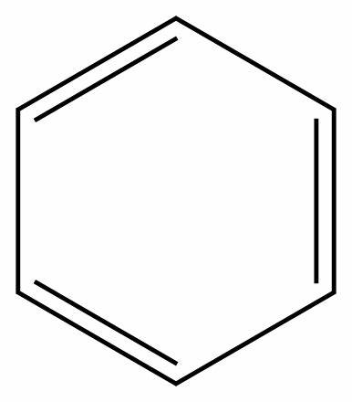

# 🎖 荣誉奖项
## 荣誉
- **2022.10**: 国家励志奖学金 (¥5,000)
- **2022.05**: 优秀团员
- **2021.10**: 国家励志奖学金 (¥5,000)
- **2021.10**: 三好学生

## 国家级奖励
- **2023.09.16**: [[*ROBOCOM*]](https://robocom.com.cn/)2023RoboCom机器人开发者大赛空中侦察项目（亚军，前2%），国家级一等奖  
- **2023.10.25**: [[*ROBOCUP*]](http://crc.drct-caa.org.cn/)2023年中国机器人大赛无人机快递运输组，国家级一等奖
- **2023.12.04**: [[*3DDS*]](https://3dds.3ddl.net/)2023年第16届全国三维数字化创新大赛（无人机设计），国家级一等奖
- **2023.05.01**: [[*ROBOCUP*]](http://crc.drct-caa.org.cn/)2022中国机器人大赛水下作业组 （季军，前5%），国家级一等奖
- **2022.07.01**: [[*CS4C*]](https://jsjds.blcu.edu.cn/index.htm)2022年(第15届)中国大学生计算机设计大赛人工智能应用，国家级二等奖
- **2023.11.30**: [[*ISCC*]](https://www.isclab.org.cn/)2023年第20届信息安全与对抗技术竞赛（ISCC）智能植保，国家级二等奖
- **2023.11.30**: [[*ISCC*]](https://www.isclab.org.cn/)2023年第20届信息安全与对抗技术竞赛（ISCC）智能灌溉，国家级二等奖
- **2022.07.01**: [[*CDEC*]](https://www.cdec.org.cn/)第16届中国好创意暨全国数字艺术设计大赛，国家级二等奖
- **2023.07.01**: [[*CRAIC*]](https://www.caairobot.com/)第二十五届中国机器人及人工智能大赛微型自主无人机
- **2022.07.01**: [[*CS4C*]](https://jsjds.blcu.edu.cn/index.htm)2022年(第15届)中国大学生计算机设计大赛微课与教学辅助
- **2022.07.01**: [[*CS4C*]](https://jsjds.blcu.edu.cn/index.htm)2022年(第15届)中国大学生计算机设计大赛物联网应用
- **2022.08.01**: [[*CRAIC*]](https://www.caairobot.com/)第二十四届中国机器人及人工智能大赛助老服务机器人赛
- **2022.07.01**: [[*ROBOCUP*]](http://crc.drct-caa.org.cn/)2021年中国机器人大赛水下作业组
- **2023.06.01**: [[*ROBOCUP*]](http://crc.drct-caa.org.cn/)2022年中国机器人大赛无人巡游组
- **2022.08.01**: [[*NECCS*]](http://www.jienengjianpai.org/)“六百光年杯”第十五届全国大学生节能减排社会实践与技竞赛，国家级三等奖
- **2023.07.01**: [[*CRAIC*]](https://www.caairobot.com/)第二十五届中国机器人及人工智能大赛无人协同赛道，国家级三等奖
- **2021.05.01**: [[*QIBEBT*]](http://energy.qibebt.ac.cn/eneco/contribution/index.html#/index)第七届全国大学生能源经济学术创意大赛，国家级三等奖
  
## 省部级奖励
- **2023.06.15**: [[*Challenge Cup*]](https://www.tiaozhanbei.net/)“青创北京”2023 年“挑战杯”首都大学生课外学术科技作品竞赛，省级一等奖
- **2023.07.01**: [[*CS4C*]](https://jsjds.blcu.edu.cn/index.htm)2023年(第16届)中国大学生计算机设计大赛人工智能，省级一等奖
- **2023.07.01**: [[*CRAIC*]](https://www.caairobot.com/)第二十五届中国机器人及人工智能大赛智慧农业赛道，省级一等奖
- **2022.10.01**: [[*MCM*]](https://www.mcm.edu.cn/)2022年高教社杯全国大学生数学建模竞赛，省级一等奖
- **2022.08.01**: [[*CRAIC*]](https://www.caairobot.com/)第二十四届中国机器人及人工智能大赛智慧农业赛，省级一等奖
- **2022.08.01**: [[*OSTC*]](http://opt.zju.edu.cn/gdjs/main.htm)光电设计大赛，省级二等奖
- **2022.08.01**: [[*QIBEBT*]](http://energy.qibebt.ac.cn/eneco/contribution/index.html#/index)北京市节能减排大赛，省级二等奖
- **2022.08.01**:[[*3DDS*]](https://3dds.3ddl.net/)全国三维数字化创新设计大赛，省级二等奖
- **2022.08.01**: [[*CRAIC*]](https://www.caairobot.com/)第二十四届中国机器人及人工智能大赛微型自主无人机飞行赛，省级三等奖
- **2022.08.01**: [[*CRAIC*]](https://www.caairobot.com/)第二十四届中国机器人及人工智能大赛人工智能创新赛，省级三等奖
- **2022.08.01**:[[*CRAIC*]](https://www.caairobot.com/) 第二十四届中国机器人及人工智能大赛智能文化创意赛，省级三等奖
- **2022.08.01**: [[*CRAIC*]](https://www.caairobot.com/)第二十四届中国机器人及人工智能大赛机器人创新赛，省级三等奖
- **2021.10.01**:[[*ROBOCOM*]](https://robocom.com.cn/) 输油管巡检技术挑战赛（深水)(2021)，省级三等奖
- **2022.10.01**:[[*ROBOCOM*]](https://robocom.com.cn/)T输油管巡检技术挑战赛（深水)(2022)，省级三等奖
- **2019.10.01**:[[*ICHO*]](https://img.chemsoc.org.cn/web/2019/03/06-%E5%B1%B1%E8%A5%BF%E7%9C%81%20%E7%AC%AC32%E5%B1%8A%E4%B8%AD%E5%9B%BD%E5%8C%96%E5%AD%A6%E5%A5%A5%E6%9E%97%E5%8C%B9%E5%85%8B%EF%BC%88%E5%88%9D%E8%B5%9B%EF%BC%89%E8%8E%B7%E5%A5%96%E5%AD%A6%E7%94%9F%E5%90%8D%E5%8D%95.pdf)第33届中国化学奥林匹克（初赛），山西省一等奖
- **2018.10.01**:[[*ICHO*]](https://img.chemsoc.org.cn/web/2019/03/06-%E5%B1%B1%E8%A5%BF%E7%9C%81%20%E7%AC%AC32%E5%B1%8A%E4%B8%AD%E5%9B%BD%E5%8C%96%E5%AD%A6%E5%A5%A5%E6%9E%97%E5%8C%B9%E5%85%8B%EF%BC%88%E5%88%9D%E8%B5%9B%EF%BC%89%E8%8E%B7%E5%A5%96%E5%AD%A6%E7%94%9F%E5%90%8D%E5%8D%95.pdf)第32届中国化学奥林匹克（初赛），山西省二等奖
