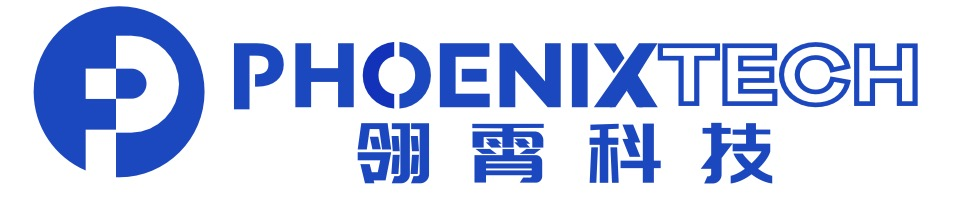

# 📖 教育经历
- *2024.09 - 至今*   ，直博生，电子信息，复旦大学，上海。
- *2020.09 - 2024.06*，本科生，计算机科学与技术，中国地质大学（北京），北京。
- *2017.09 - 2020.06*，忻州第一中学，忻州。

# 💻 实习经历
- *2021.06 - 2023.09*，[北京地大博创科技有限公司，北京。](https://www.bbcpetro.com/)

#  创业经历
- *2023.11 - 2024.03*，北京飞翼凌霄信息技术有限公司，创始人。
- *2024.04 - 2024.11*，宁波翎霄科技有限责任公司，创始人。

# 💡 资金支持
*Xbotpark种子阶段探索基金*
- **资金额度：** 500000
- **投资机构：** Xbotpark基地

*大学生创新创业基金（2024–2026）*
- **资金额度：** 50000
- **资助单位：** 中国地质大学（北京）

*大学生创新创业基金（2022–2023）*
- **资金额度：** 10000
- **资助单位：** 中国地质大学（北京）